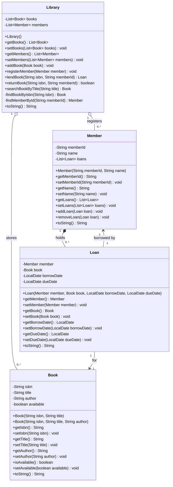

# Question One Answer

## UML Class Diagram

## Relationship Explanation

An association is a general link between classes, such as a `Loan` being linked to exactly one `Book` and exactly one `Member`.

Aggregation is a weak whole-part relationship. The relationship between `Library` and `Book`, and between `Library` and `Member`, is aggregation because the library stores books and members, but the books and members can still exist outside the library system.

Composition is a strong whole-part relationship. The relationship between `Member` and `Loan` is composition because the active loan belongs to the member's current borrowing record and should be removed when the member's active loan record is removed.

The multiplicity `1..*` means one or more. For example, if a library were required to have at least one book, the relationship from `Library` to `Book` could be shown as `1..*`, meaning one library has one or more books.

## Java Files Submitted

- `Book.java`
- `Member.java`
- `Loan.java`
- `Library.java`
- `LibraryDemo.java`

The program enforces the rule that a book may be on at most one active loan at a time. If a second member tries to borrow a book that is already on loan, the operation is rejected gracefully.
