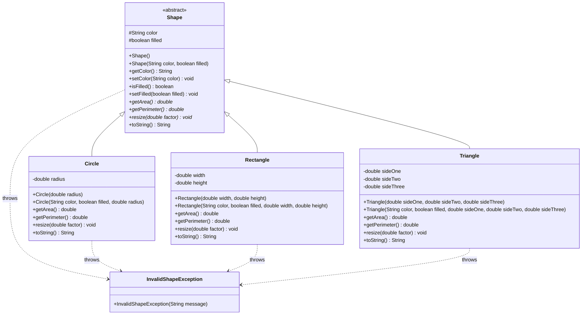

# Question 2 Answer

## UML Class Diagram

The abstract class name is `Shape`. The abstract methods are `getArea()`, `getPerimeter()`, and `resize(double factor)`.

## Exception Design

`InvalidShapeException` is implemented as an unchecked exception by extending `RuntimeException`. I chose unchecked because invalid shape dimensions, impossible triangle sides, and non-positive resize factors are validation errors that should be prevented by the program logic, while still allowing the driver to catch and handle them when needed.

## Dynamic Binding Explanation

In `printAreas(Shape[] shapes)`, each item is stored using a superclass reference, but Java calls the correct subclass version of `getArea()` at runtime. For example, when the output says `Circle area = 78.54`, the method call uses the `Circle` implementation even though the array type is `Shape[]`.

## Why Shape Is Abstract

`Shape` is abstract because a general shape does not have enough information to calculate area or perimeter. Only specific shapes such as `Circle`, `Rectangle`, and `Triangle` can provide those calculations.

If you try to create a `Shape` directly using `new Shape()`, Java gives a compile-time error because abstract classes cannot be instantiated.

## Java File Submitted

- `ShapeDemo.java`

The file contains `ShapeDemo`, `Shape`, `Circle`, `Rectangle`, `Triangle`, and `InvalidShapeException` in one runnable Java file.
